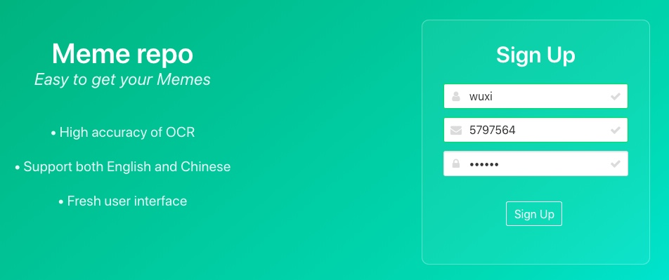
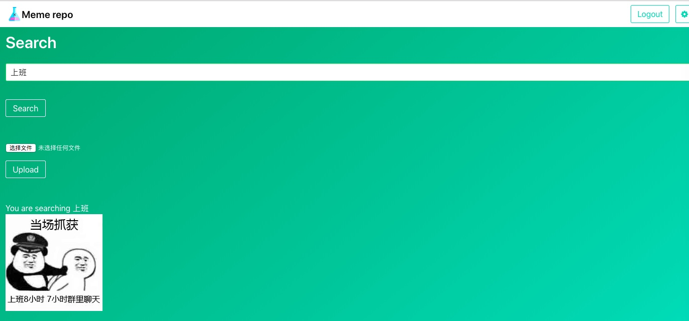
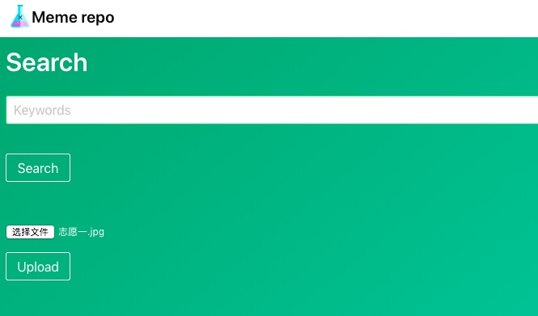

# Readme

### Locations

1. Data files:

2. Code:

	2.1 Code for running web application

	2.2 Code for running inner-text detection

### Quick Start:

Connect the vpn.cs.hku.hk first, then

For normal users:

1. Login gpu3 with password:student
2. su hduser password:student
2. cd ~/newmeme/Flaskex
3. python3 app8.py
4. Visit http://202.45.128.135:20703/ 


For users to run inner-text detection of a large scale images :

1.

2.

3.

4.


### Run locally

Ensure that you have installed spark and hadoop successfully. 

1. Install tesseract

tesseract:
For Linux:

```
sudo apt install tesseract-ocr
sudo apt install libtesseract-dev
sudo apt install tesseract-ocr-chi-sim
```

For other OS versions, please see:
[link](https://github.com/tesseract-ocr/tesseract/wiki)

2. Install packages

```
pip3 install -r requirment.txt
```

For installing imageAI:

```
pip3 install https://github.com/OlafenwaMoses/ImageAI/releases/download/2.0.1/imageai-2.0.1-py3-none-any.whl

pip3 install https://github.com/OlafenwaMoses/ImageAI/releases/download/1.0/resnet50_coco_best_v2.0.1.h5 
```

3. Run the web server

```
python3 app.py
```

## 4. Visit localhost:5000 

5. Sign up and login

6. Search for memes

7. Upload a meme 
